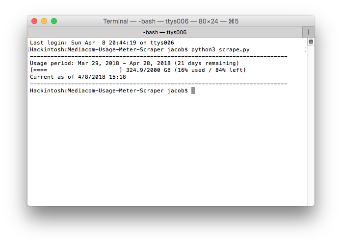

# Mediacom Usage Meter Scraper
>Because it's too much damn work to log into Mediacom's crappy website every time I want to check my bandwidth usage status.

This simple Python script uses Selenium with a headless instance of Chrome (via chromedriver) to log into the Mediacom bandwidth usage site, scrape some data about your current monthly bandwidth usage, and display it to you in the console output.



## Installation

Download or clone the repo into a folder. Download a copy of the latest version of [chromedriver](https://sites.google.com/a/chromium.org/chromedriver/downloads), place it in the project folder, and make sure the binary is named `chromedriver`. Edit `config.example.json` with your Mediacom username & password, then rename the file to `config.json`. Check to make sure that you have all the dependencies (you may need to install selenium via pip). If you are not running on OSX, edit `chrome_options.binary_location` in `scrape.py` to correctly reflect the path to your Chrome binary.

## Usage

```sh
python3 scrape.py
```

WARNING: If you run the script too frequently, you are likely to eventually encounter an error where the script fails to run. If you persist in running the script too frequently after encountering this error, you may end up being temporarily locked out of your Mediacom account. The lockout lasts for approximately 30 minutes, during which time you cannot login to the site at all, even manually in a web browser. A red error message will be displayed if you attempt to manually login in a web browser during this lockout period, and it will say that your account is locked. Once the lockout expires, you will be able to access your account (and use this script) once again. I am not sure what the exact criteria for the lockout are, and I have been unable to reproduce a lockout condition so far (I've only seen it happen once earlier on during bot development after a long string of script runs), but it is something that I want to be sure any potential users of this script are aware of.

## Release History

* 1.0
    * First public release

## Meta

Written by Jacob Baratta.

Distributed under the MIT license. See ``LICENSE`` for more information.

[https://github.com/jacobbaratta](https://github.com/jacobbaratta)
